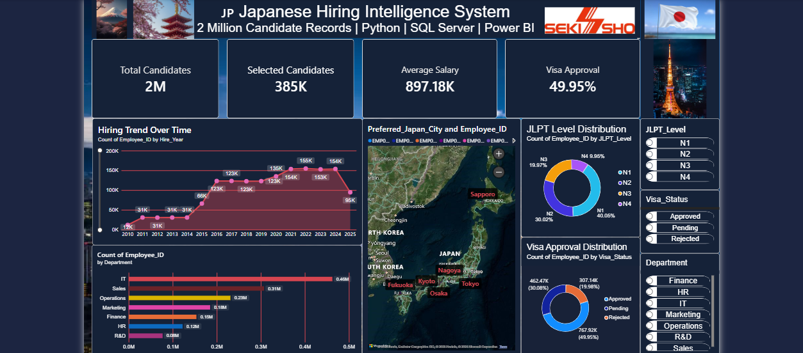
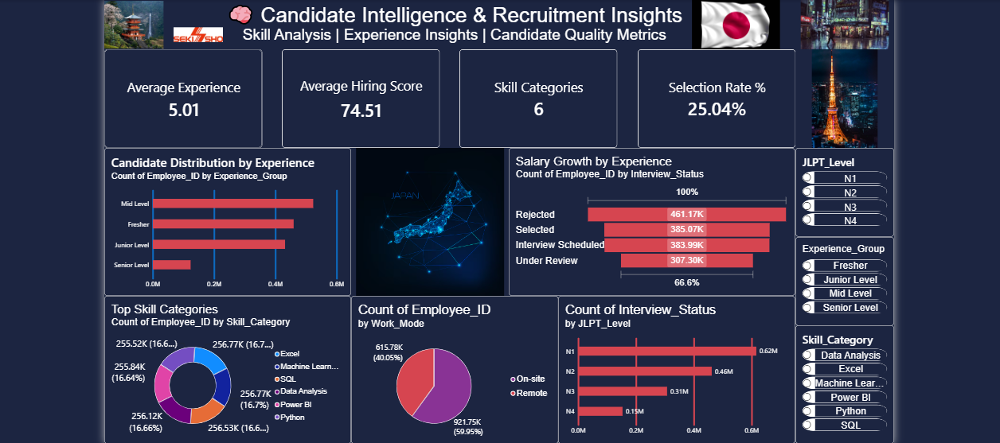
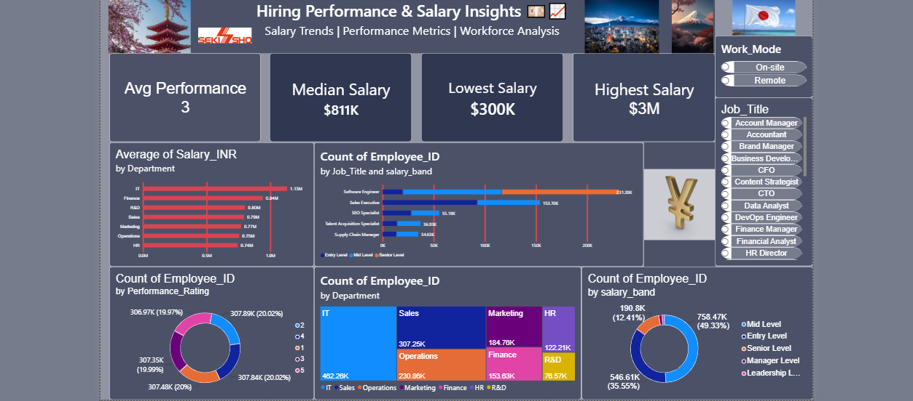

# 🇯🇵 Japanese Hiring Intelligence System


A full **End-to-End Data Analytics Project** focused on analyzing Japanese recruitment trends using **Python, SQL Server, Power BI, and GitHub Pages**.

This project transforms raw HR recruitment data into meaningful business insights through data cleaning, SQL analysis, interactive dashboards, and a Japan-themed portfolio website.

---

## 📌 Project Overview

The objective of this project is to analyze recruitment patterns in Japan and answer key business questions such as:

* Which departments hire the most candidates?
* Does JLPT level impact selection rate?
* Which job roles offer the highest salary?
* How do hiring scores influence final selection?

---

## 🛠 Tech Stack

* **Python** → Data Cleaning & Preprocessing
* **SQL Server** → Data Analysis & Querying
* **Power BI** → Dashboard & Visualization
* **GitHub Pages** → Live Project Deployment
* **HTML / CSS / JavaScript** → Portfolio Website

---

## 🔄 Data Analytics Workflow

Raw HR Dataset
→ Python Cleaning
→ SQL Analysis
→ Power BI Dashboard
→ Web Deployment

---

## 🧹 Python Data Cleaning

Performed data preprocessing using Python:

* Removed duplicates
* Handled missing values
* Standardized salary columns
* Fixed inconsistent formatting
* Prepared clean dataset for analysis

Example:

```python
df.drop_duplicates(inplace=True)
df.fillna(method='ffill', inplace=True)
```

---

## 🗃 SQL Analysis

Used SQL queries to extract insights such as:

* Average salary by department
* Candidate distribution by JLPT level
* Selection counts by interview status
* Hiring trends across departments

Example:

```sql
SELECT Department, AVG(Salary)
FROM Hiring_Data
GROUP BY Department;
```

---

## 📊 Power BI Dashboard

Dashboard includes:

### Page 1 — Executive Overview

* Total Candidates
* Selected Candidates
* Average Salary
* Hiring Trends

### Page 2 — Hiring Insights

* Selection Rate by JLPT
* Interview Status Analysis
* Hiring Score Comparison

### Page 3 — Salary & Geographic Analysis

* Salary Distribution
* Work Mode Analysis
* Location Insights

---

## 🔍 Key Insights

* **385K+ selected candidates**
* Higher **JLPT levels improve selection chances**
* Finance-related roles show strong compensation
* Hiring scores strongly correlate with selection probability

---

## 🌐 Live Project

GitHub Pages Link:
(Add your live link here after deployment)

---

## 📷 Project Screenshots
## 📷 Dashboard Preview

### Page 1 — Executive Overview



### Page 2 — Candidate Intelligence



### Page 3 — Salary & Performance Insights




## 👨‍💻 About Me

**Chandra Mohan Singh Sisodiya**

Data Analyst Trainee | SQL | Python | Power BI 

I am passionate about transforming raw data into actionable insights and continuously improving my analytics skills.

---

## ⭐ If you liked this project

Give this repository a **star** and connect with me on LinkedIn.
